# Simulacao de Jogo de Tabuleiro Estrategico
Estrutura de dados e Algorítmos.
Nomes: Alan dos Santos Bauer e Adrian dos Santos Garbellotto

## 1. Resumo do projeto e regras do jogo

O projeto implementa, em Java, um jogo de tabuleiro estrategico inspirado em jogos de gestão imobiliaria. Os jogadores percorrem um tabuleiro circular, compram propriedades, pagam aluguel, recebem salario ao passar pelo Inicio, sofrem impostos, recebem restituicoes, participam de leiloes, sacam cartas de Sorte/Reves e podem ser enviados para a prisao.

O jogo termina quando o limite de rodadas e atingido ou quando resta apenas um jogador ativo. Ao final, o sistema exibe a classificacao por patrimonio, a quantidade de voltas completas de cada jogador, o maior aluguel cobrado e o historico final das ultimas rodadas.

O sistema ja inicia com quatro jogadores de exemplo para facilitar testes: Marina (Especulador), Rafael (Negociante), Livia (Advogado) e Gustavo (Construtor). Tambem inicia com 12 imoveis do tema Cidades Brasileiras.

## 2. Estruturas para jogadores e imoveis

Os jogadores e imoveis foram mantidos em `ArrayList`, pois nessas colecoes o sistema precisa principalmente cadastrar, listar, buscar por ID e percorrer todos os elementos em ordem de turno ou ordem de cadastro. Essa escolha deixa as operacoes CRUD simples e diretas, enquanto as estruturas obrigatorias do trabalho foram implementadas manualmente onde elas sao parte central da regra: tabuleiro, baralho, historico e fila da prisao. O uso de `ArrayList` aqui e justificavel porque estas colecoes nao modelam as estruturas de dados centrais exigidas pelo enunciado, apenas armazenam os registros do jogo.

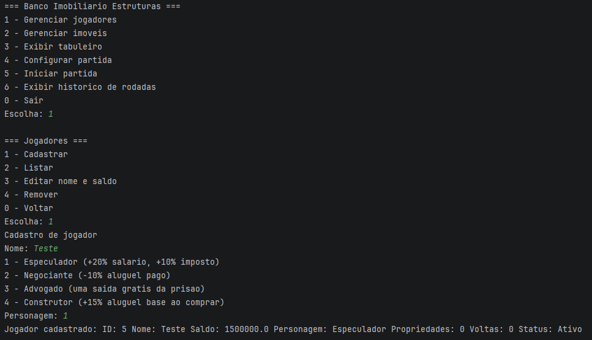

Legenda: Tela de cadastro de jogador mostrando nome e personagem selecionado.

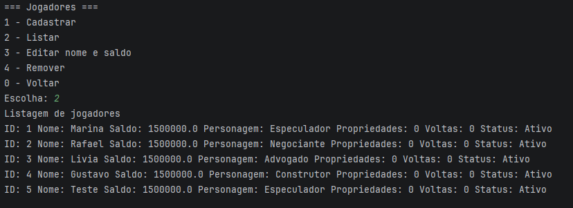

Legenda: Lista de jogadores cadastrados antes do inicio da partida.

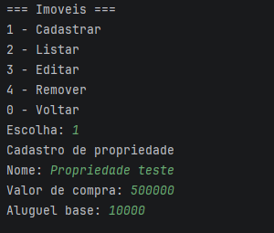

Legenda: Tela de cadastro de propriedade com nome, valor de compra e aluguel base.

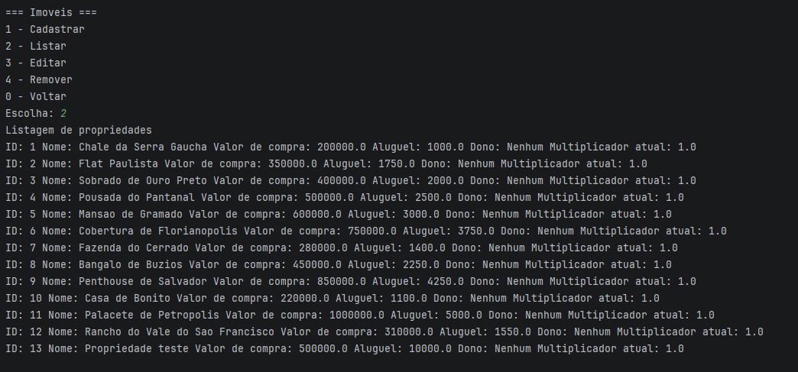

Legenda: Lista de propriedades cadastradas com valores, aluguel, dono e multiplicador.

## 3. Lista duplamente ligada circular no tabuleiro

O tabuleiro foi modelado pela classe `ListaCircular`, formada por nos `NoCasa`. Cada no possui ponteiros para o anterior e para o proximo. Essa estrutura e mais adequada que uma lista simples porque as cartas de Reves exigem retrocesso real no tabuleiro. Tambem e mais adequada que um array porque o comportamento circular fica natural: a ultima casa aponta para a primeira, e a primeira aponta para a ultima.

Composicao do tabuleiro:

- 1 casa Inicio.
- 12 casas de Imovel, uma para cada propriedade pre-cadastrada.
- 3 casas Sorte/Reves.
- 2 casas Imposto.
- 2 casas Restituicao.
- 1 casa Prisao.
- 2 casas Leilao.

Total: 23 casas.

Ordem das casas: Inicio, Chale da Serra Gaucha, Sorte/Reves, Flat Paulista, Imposto, Sobrado de Ouro Preto, Restituicao, Pousada do Pantanal, Prisao, Mansao de Gramado, Leilao, Cobertura de Florianopolis, Sorte/Reves, Fazenda do Cerrado, Bangalo de Buzios, Imposto, Penthouse de Salvador, Sorte/Reves, Casa de Bonito, Restituicao, Palacete de Petropolis, Leilao, Rancho do Vale do Sao Francisco.

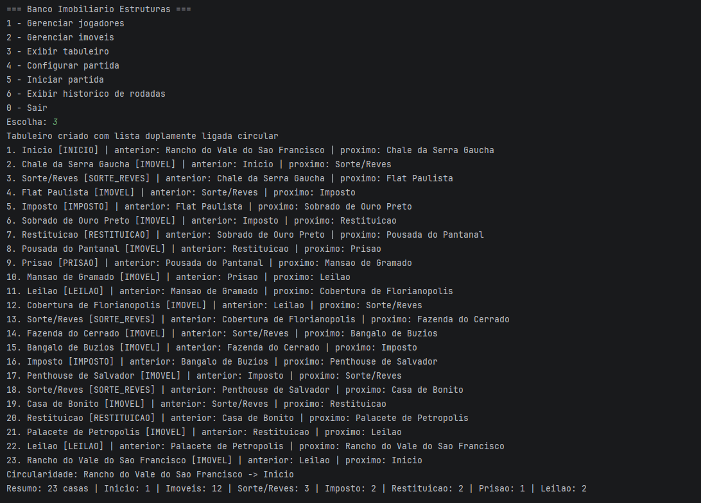

Legenda: Exibicao das casas do tabuleiro em ordem, mostrando anterior, proximo e a ligacao circular da ultima casa para o Inicio.

## 4. Pilha do baralho

O baralho foi implementado manualmente com a classe `PilhaBaralho`, usando o principio LIFO: a ultima carta empilhada e a primeira a ser sacada. Quando a pilha fica vazia, o sistema remonta uma lista com 12 cartas, embaralha com `Collections.shuffle` e empilha novamente.

Composicao do baralho:

- 6 cartas de Sorte: ganhos de dinheiro e avancos.
- 6 cartas de Reves: perdas de dinheiro, retrocessos e envio para a prisao.

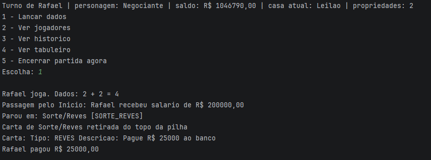

Legenda: Jogador parando em Sorte/Reves, carta sacada do topo da pilha e efeito aplicado.

## 5. Filas de historico e prisao

O historico usa a classe `FilaHistorico`, uma fila manual com capacidade maxima. Quando a capacidade e atingida, o registro mais antigo e descartado antes da entrada do novo registro.

A prisao usa a classe `FilaPrisao`, tambem manual. Os jogadores presos entram no fim da fila e tentam sair na ordem em que chegaram, respeitando pagamento de fianca, dados duplos, terceira tentativa ou a habilidade do Advogado.

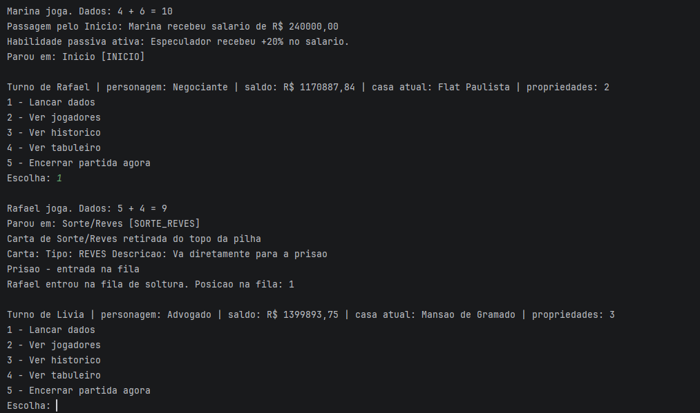

Legenda: Jogador enviado para a prisao com a posicao na fila de espera.

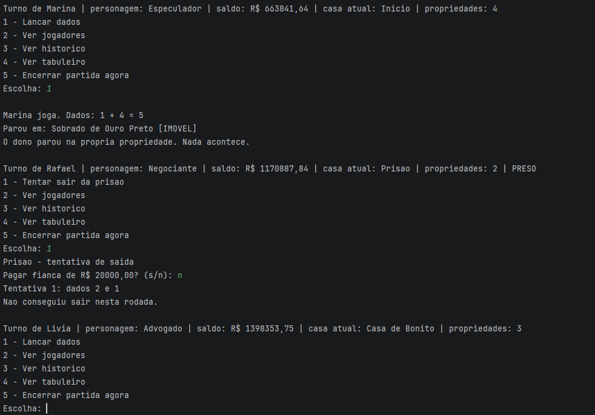

Legenda: Jogador tentando sair da prisao por isencao, fianca, dados duplos ou terceira tentativa.

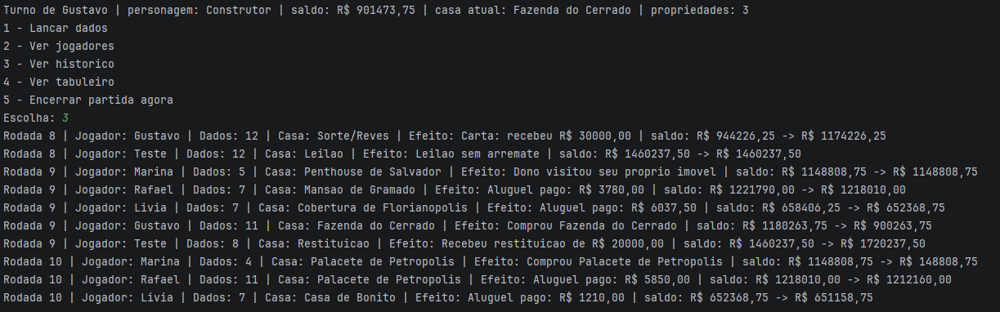

Legenda: Historico com pelo menos 8 entradas, contendo rodada, jogador, dados, casa e efeito.

## 6. Habilidades passivas dos personagens

As habilidades foram concentradas nas classes de personagem:

- `Especulador`: recebe 20% a mais de salario e paga 10% a mais de imposto.
- `Negociante`: paga 10% a menos de aluguel.
- `Advogado`: pode sair da prisao uma vez sem pagar fianca.
- `Construtor`: aumenta em 15% o aluguel base dos imoveis que compra.

Essa organizacao evita espalhar numeros fixos por todo o fluxo principal do jogo.

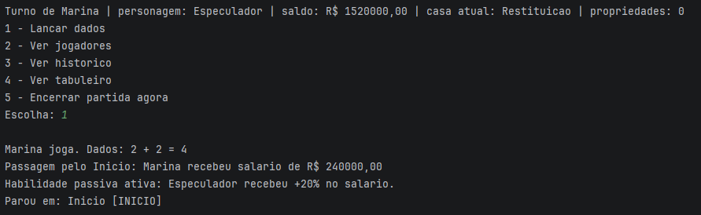

Legenda: Mensagem do sistema deixando explicita a habilidade aplicada.

## 7. Passagem pelo Inicio e retrocesso

Ao avancar, o sistema percorre a lista casa por casa. Quando o proximo no visitado e o Inicio, o salario e pago e a volta completa e registrada. Ao retroceder, o sistema tambem percorre pelos ponteiros anteriores, mas se cruzar o Inicio imprime que retrocesso nao gera salario.

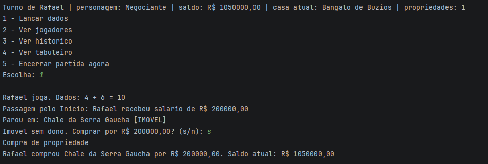

Legenda: Jogador completando volta, recebendo salario e atualizando saldo.

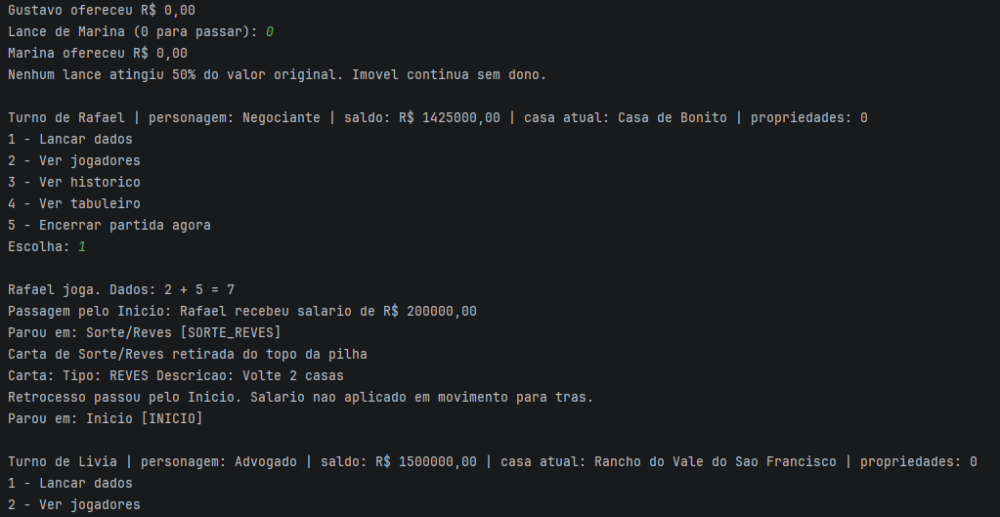

Legenda: Jogador cruzando o Inicio em retrocesso, sem receber salario.

## 8. Funcionalidades adicionais obrigatorias

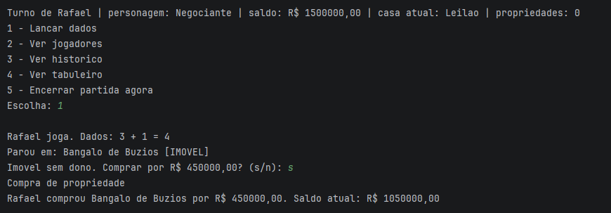

Legenda: Jogador comprando imovel sem dono, com confirmacao e saldo atualizado.

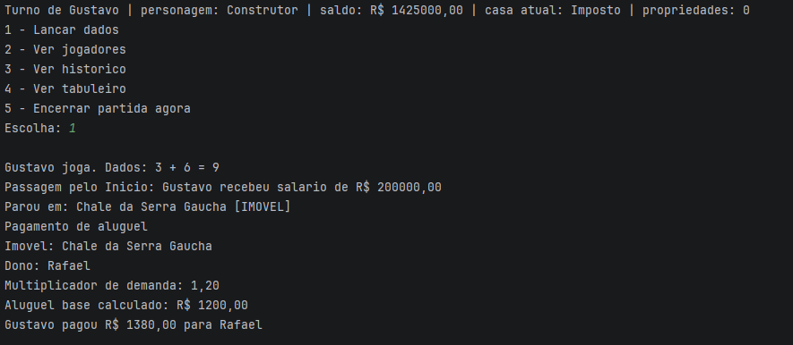

Legenda: Jogador pagando aluguel a outro jogador, com multiplicador de demanda visivel.

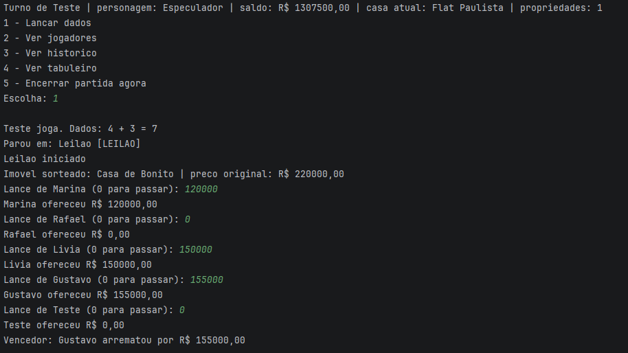

Legenda: Casa de Leilao ativada, imovel sorteado, lances e resultado final.

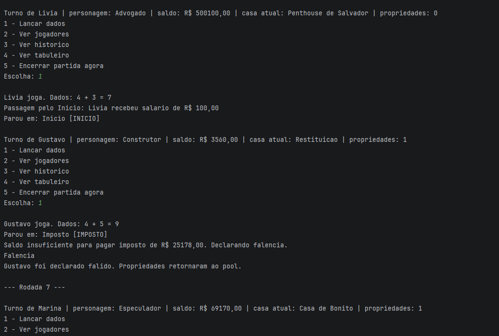

Legenda: Jogador declarado falido e retorno das propriedades ao pool quando aplicavel.

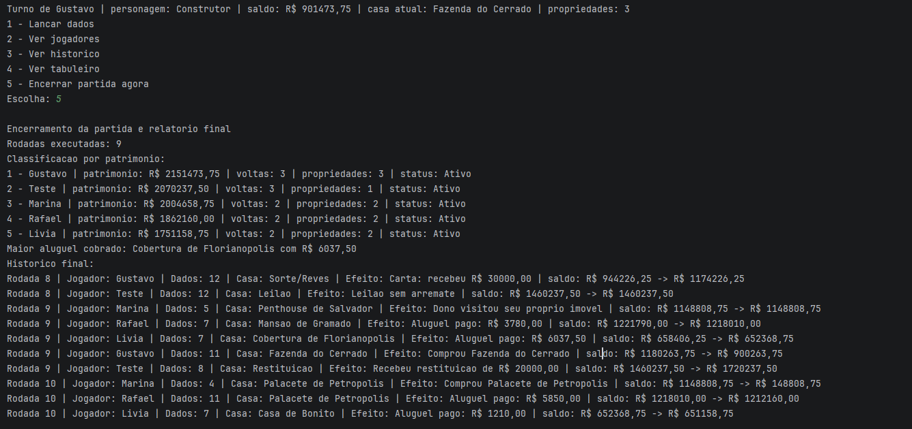

Legenda: Relatorio final com ranking, voltas completas, maior aluguel e historico.

## Conclusão

O projeto implementa as estruturas de dados e as regras solicitadas pelo enunciado, incluindo:

- Lista circular para o tabuleiro, permitindo avanços e retrocessos corretos;
- Pilha para o baralho de Sorte/Reves;
- Filas manuais para histórico e fila da prisão;
- Regras de jogo: compra, aluguel, leilão, imposto, restituição, prisão e falência.
