### 4.1 Identificação
Nome: Alan dos Santos Bauer

### 4.2 Introdução
Implementar estruturas de dados manualmente é importante porque ajuda a entender como a memória é organizada e manipulada durante a execução de um programa, além de permitir o controle direto das ligações entre os elementos por meio de referências (ponteiros). Isso torna mais claro o funcionamento de operações como inserção, remoção e navegação na estrutura, desenvolvendo o raciocínio lógico e a compreensão de como o computador gerencia os dados internamente, sem depender apenas de estruturas prontas da linguagem.

### 4.3 Implementação
A estrutura do nó depende do tipo de lista ligada utilizada no exercício. No caso da lista simplesmente ligada, o nó possui apenas a referência para o próximo elemento, enquanto na lista duplamente encadeada ele possui referências para o próximo e o anterior, permitindo a navegação em ambas as direções. Já na lista circular, o último nó aponta novamente para o primeiro, formando um ciclo contínuo.

Nos casos críticos, foram tratados possíveis erros como lista vazia, opções inválidas e tentativas de acesso a elementos inexistentes, garantindo que o programa não apresente falhas durante a execução.

Também foram realizadas corretamente as atualizações de ponteiros nos métodos de inserção, remoção e navegação, assegurando a integridade da estrutura e o funcionamento adequado das listas em todas as operações.

### 4.4 Evidências de Execução
As fotos mostram todo o funcionamento de cada sistema.

## Cafeteria: 
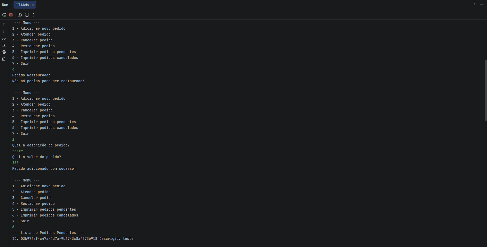
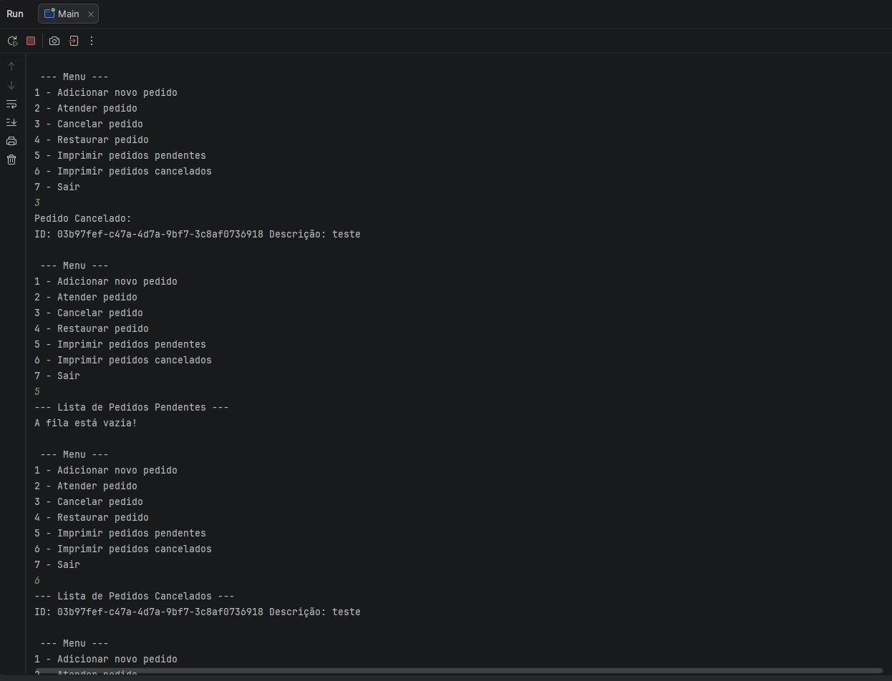
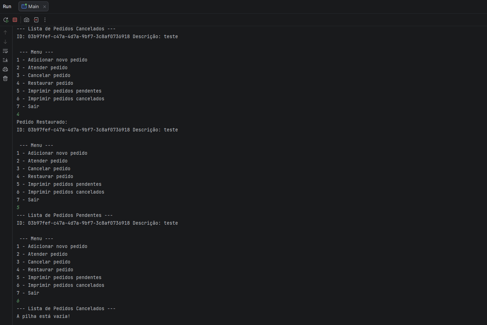

## Playlist Musical: 
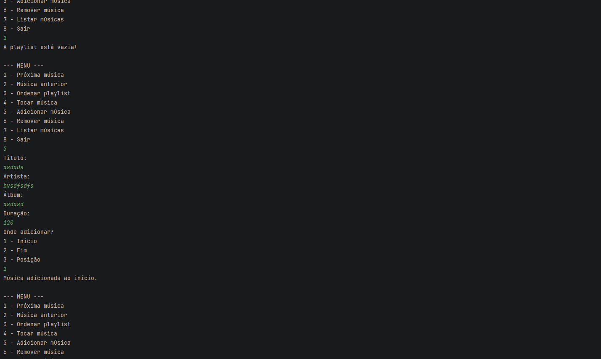
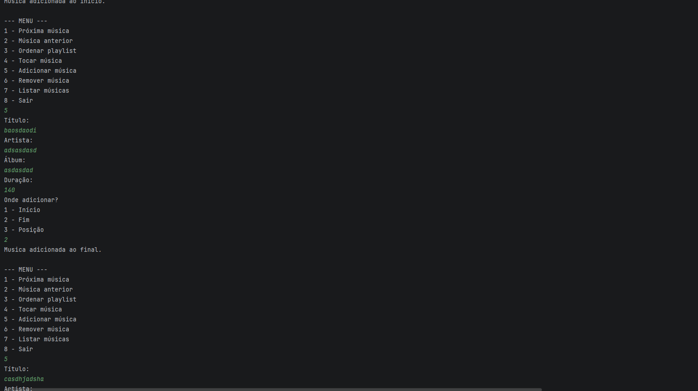
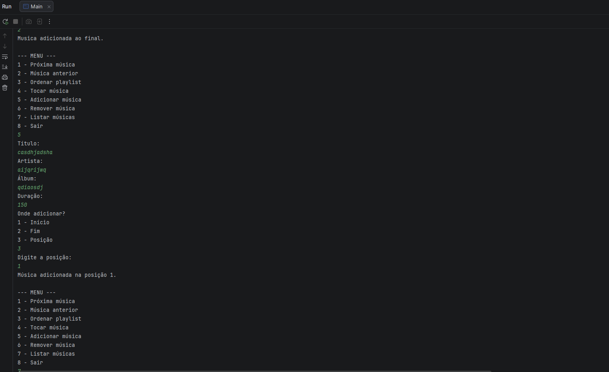
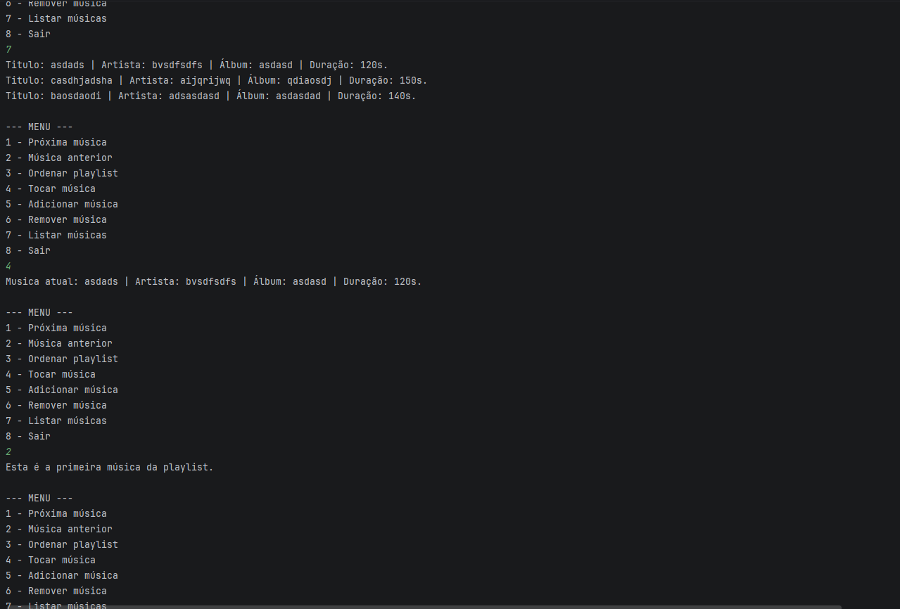
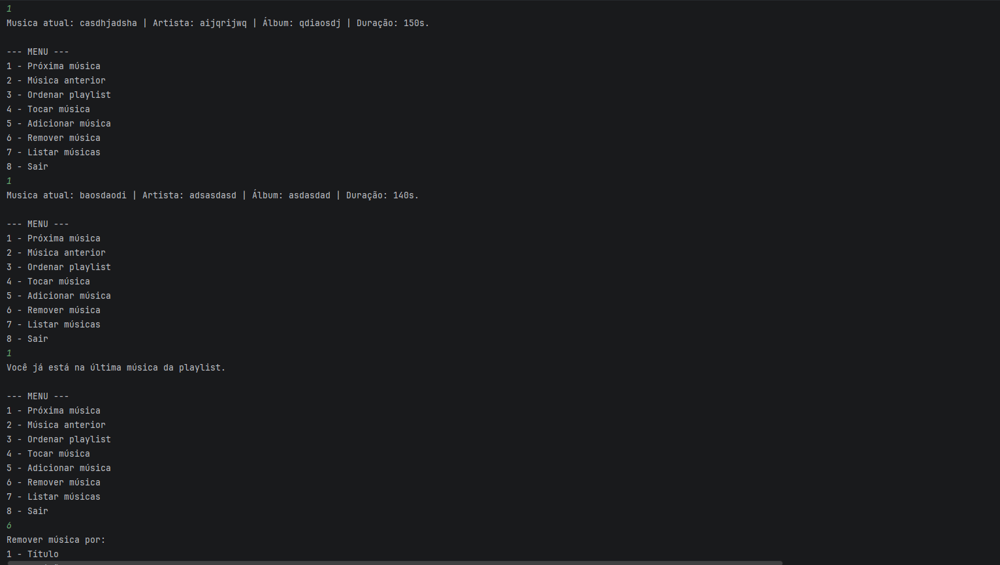
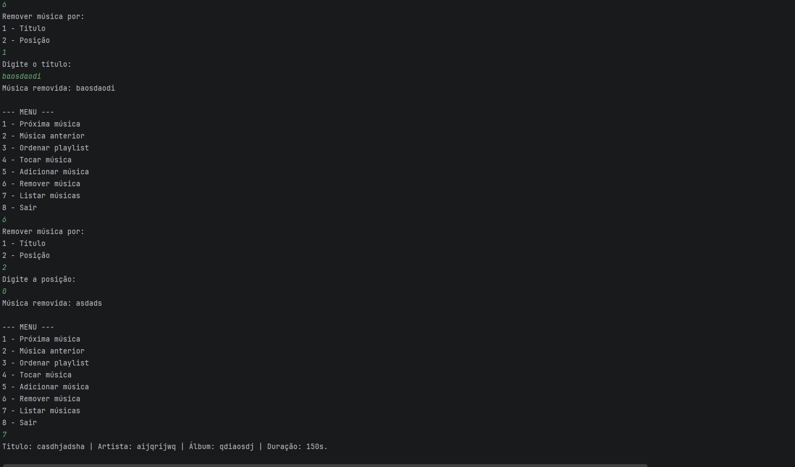
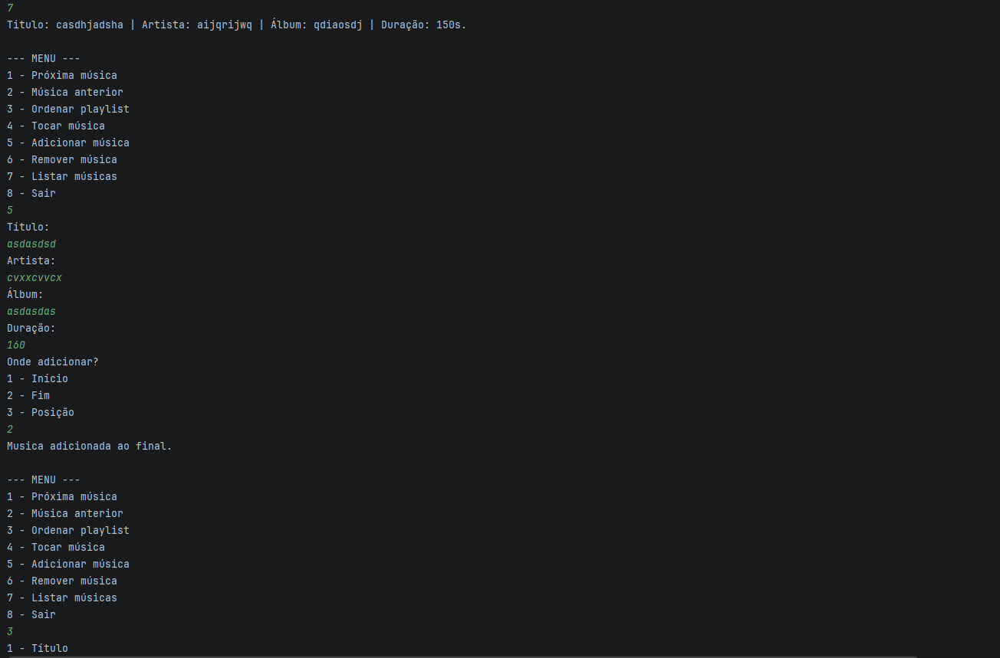
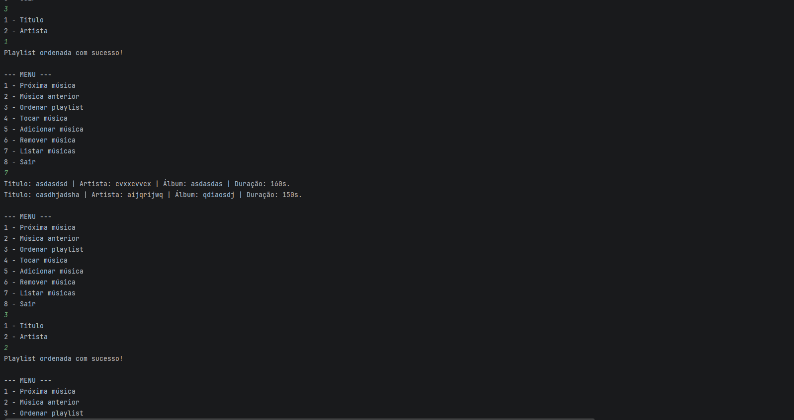
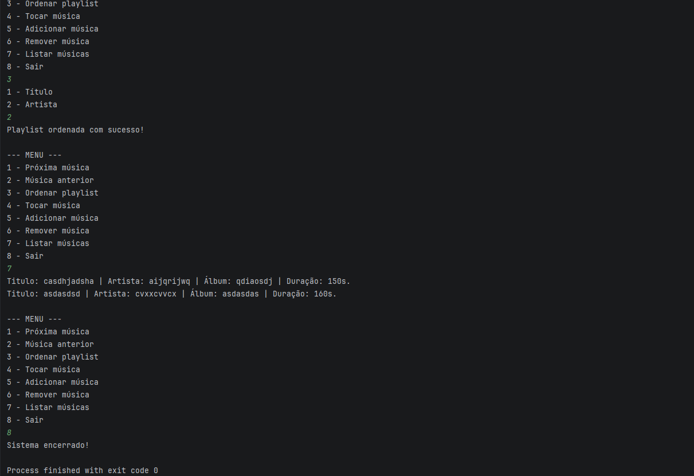

## Painel Digital:
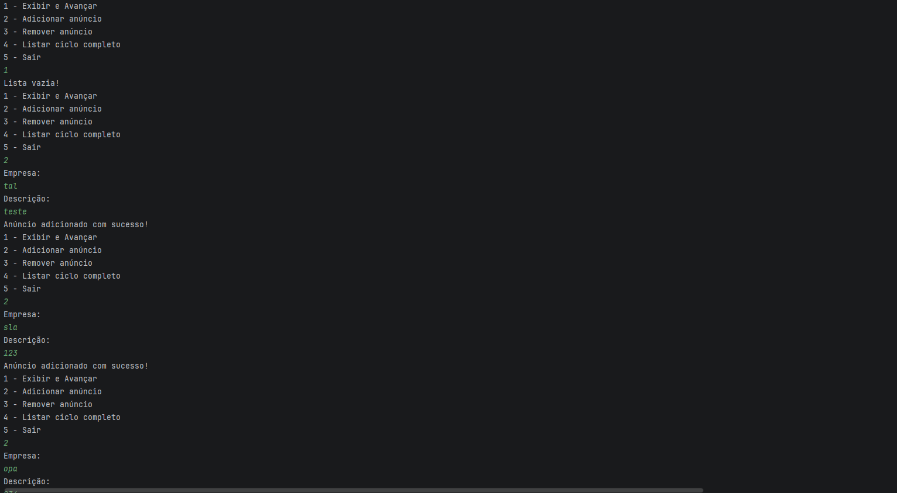
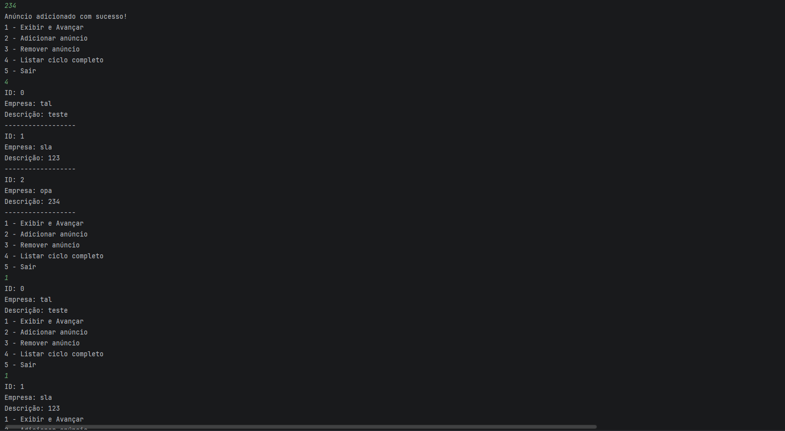
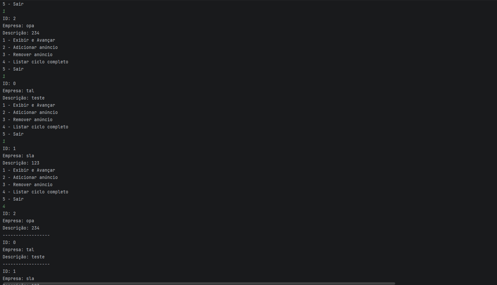
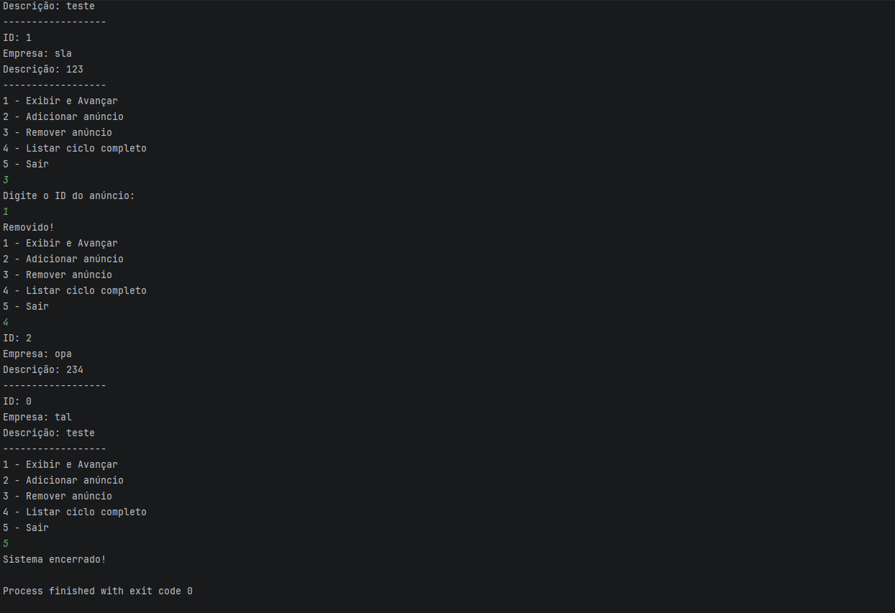

### 5 Conclusão
Durante o desenvolvimento do projeto, as maiores dificuldades foram na implementação dos métodos das listas ligadas, além da pilha e da fila, principalmente na hora de entender e manipular os nós e os ponteiros corretamente em cada operação. No começo foi mais complicado, mas com a prática fui entendendo melhor como funcionava e as coisas foram ficando mais naturais. Também consegui entender melhor as diferenças entre lista simplesmente e duplamente encadeada, e como cada nó é montado e se conecta com o outro.

Na parte da main foi mais tranquilo, o maior trabalho foi mesmo a lógica do menu, mas nada muito complicado comparado às estruturas de dados. No geral, achei que consegui aprender bem o conteúdo e entender na prática como essas estruturas funcionam, principalmente como os nós são organizados e manipulados em cada caso.
